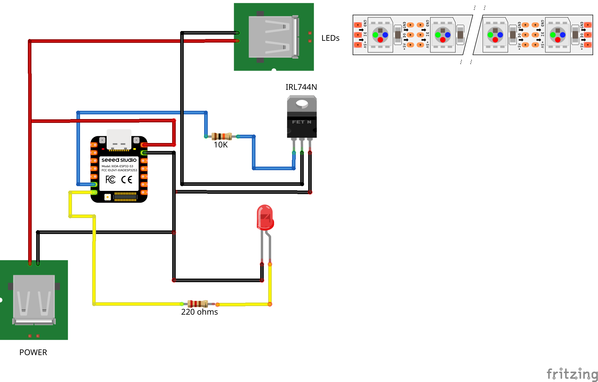
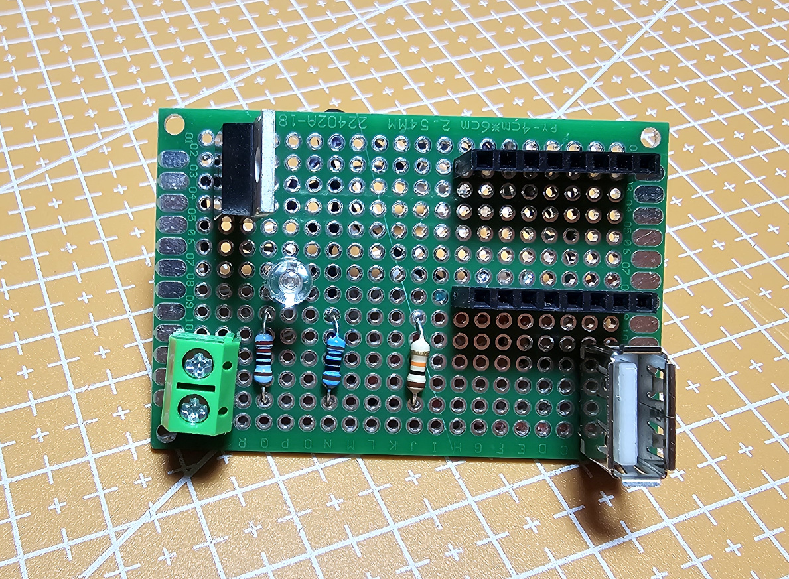
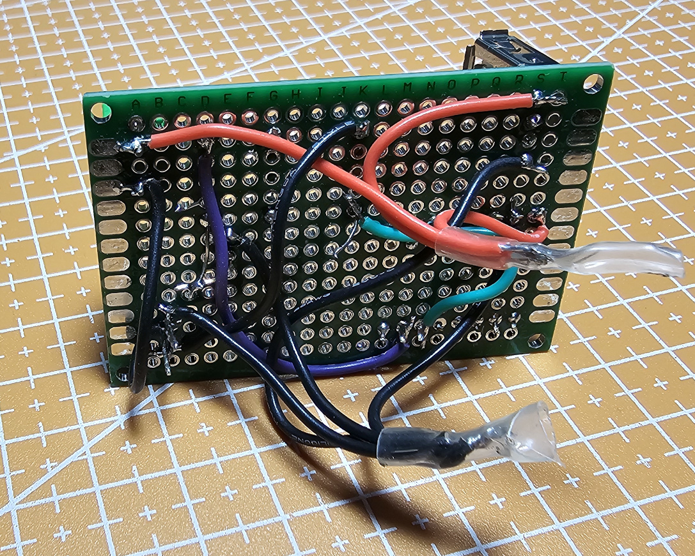
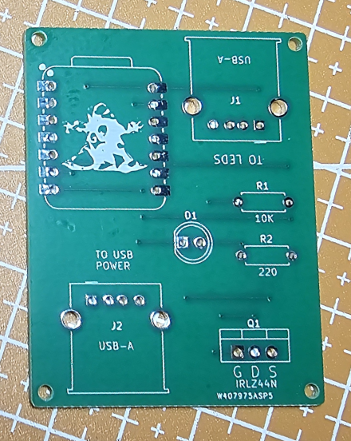
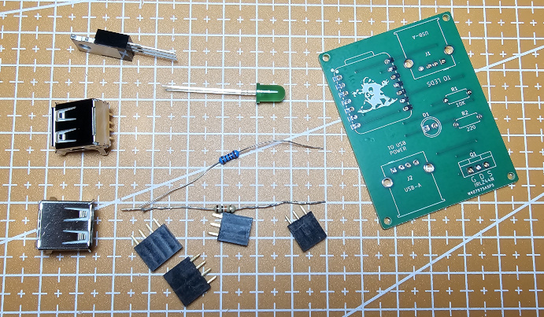
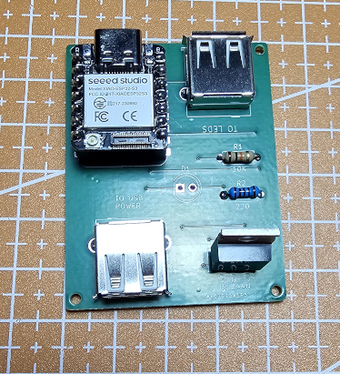
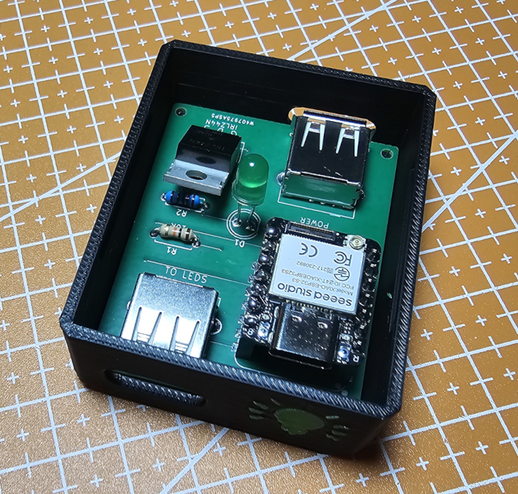
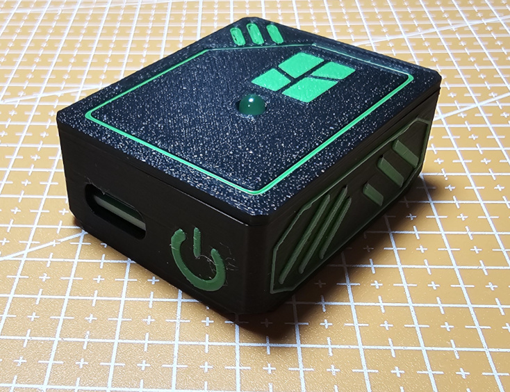

## Electrical 

### Schematics
Here's the schematics for the "Bambu Lights" project:

You'll need:

* Seeed Studio Xiao ESP32-S3
* 10k resistor
* 220 ohms resistor
* 5mm led (color not important)
* 2x USB-A PCB mount
* IRL744N Mosffet

Following the schematics you'll end up with something like this (hope better):

and the back

This is an older version.
It still has 3 resistors, a barrel jack to connect the LEDs and a straight USB-A PCB connector for the POWER. 

### PCB

Here's the PCB. 

[And here's the link to PCBWay if you want to make it.](https://www.pcbway.com/project/shareproject/Bambu_Lights_8b3fba62.html)

## Assembly

To assembly it you're going to need:

* PCB
* 2x USB-A PCB Mount
* headers for the Xiao ESP32-S3
* LED 5mm - color not important
* 220 ohms resistor
* 10k resistor
* IRLZ44N Mosffet

To assemble it, just place the pieces in the right places - it's not hard and all the holes are identified :smile: ! 

Before soldering the LED, measure the length of the legs so, when you place everything inside the 3D printed enclosure, the LED stays near the lid, almost touching it. 

**NOTE:** When assembling the PCB into the 3D printed enclosure, check the labels near the USB-A PCB mounts. 

The one labeled **POWER** is to the side where is the *POWER Symbol* and the one labeled **To LEDS** is to the side where the *LED symbol* is. 

To secure it to the printer, use a magnetic strip glued to the enclosure. 
