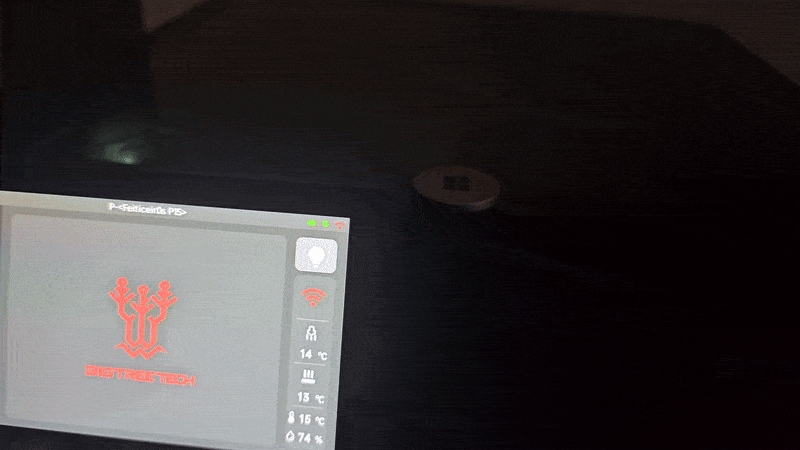
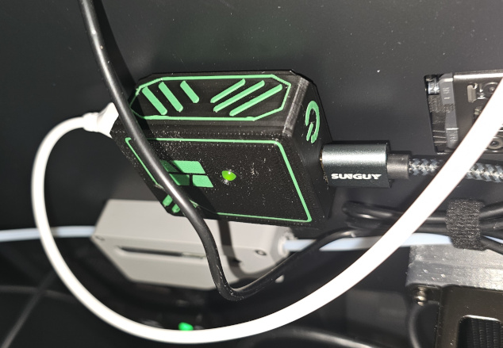
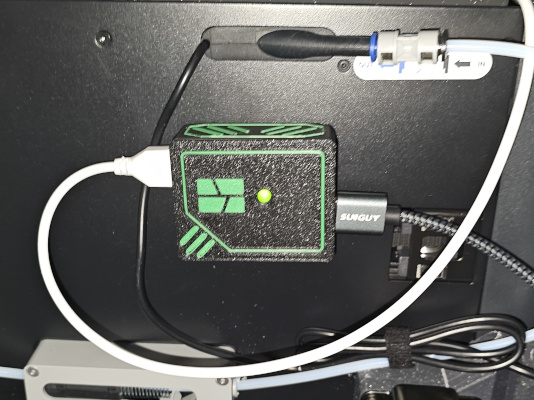
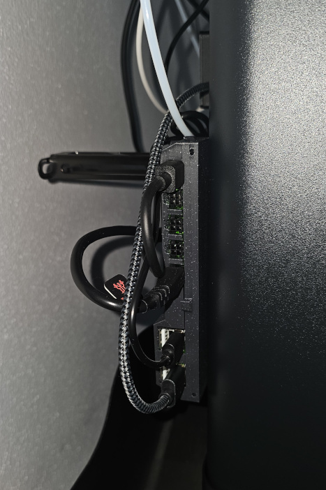

# Bambu P1S – External LED Light (MQTT Controlled)

This project adds an external LED light strip to the Bambu Lab P1S printer, synchronized with the internal chamber light using MQTT over the local network.

The goal is to improve visibility inside the printer while keeping the behavior fully aligned with the printer’s native light control, without modifying firmware or adding manual switches.

---

## Introduction

The built-in light of the Bambu P1S is functional but relatively weak, especially for long prints, monitoring, or video recording.

You have two options to add a LED strip to the printer:

* Add a LED strip that consumes less than 0.3 amps and you can replace the connection to the onboard LED light and use the printer button to turn the light on and off
* Add a LED strip that consumes more than 0.3 amps, use an external power and not control the leds using the printer. 

Instead of using an always-on LED strip or a separate switch, and not being able to use the printer to turn the lights on and off, this project listens to the printer’s own MQTT messages and mirrors the state of the internal chamber light. 

When the chamber light turns on, the external LED strip turns on. When it turns off, the external light turns off as well, using smooth fade-in and fade-out transitions.

Everything runs locally.

## Why This Project

- Improve internal visibility of the printer
- Keep lighting behavior consistent with the printer
- No firmware modifications
- No cloud services
- No manual controls
- Fully reversible installation
- Smooth and non-intrusive light transitions

## How It Works

- An ESP32 connects to the same local network as the printer
- It subscribes to the MQTT topic published by the printer
- The printer reports its internal state, including the chamber light
- When the chamber light state changes:
  - ON → external LED fades in
  - OFF → external LED fades out
- A MOSFET switches the LED power safely

## Hardware Required

### Electronics
- ESP32 board (Seeed XIAO ESP32-S3 used in this project)
- IRLZ44N MOSFET
- 10k resistor
- 220 ohms resistor
- 5mm LED (color not important)
- 2x USB-A Pcb mount

### Power

- Powered via USB
- LED power is routed through the ESP32 5 V pin by design
- Common ground between ESP32 and LED strip

## 3D Printed Parts

A custom 3D printed enclosure is used to:

- Hold the PCB securely
- Protect the electronics
- Provide cable strain relief
- Mount the assembly on the back of the printer

[STL files are provided and can be printed without supports.](3D/README.md)

## Electrical Schematic and PCB

The schematic includes:

- ESP32 GPIO to MOSFET gate connection
- Gate pull-down resistor
- MOSFET low-side switching for the LED strip
- Shared ground reference
- Status LED output

The schematic files are included in the repository, in the [PCB directory.](Electrical/README.md)

### PCB

A dedicated PCB was designed specifically for this project.

[You can get it directly from PCBWay.](https://www.pcbway.com/project/shareproject/Bambu_Lights_8b3fba62.html) 

**FYI:** I don't get anything from it, but they have sponsered it and I'm gratefull for it. 

The PCB is not necessary for the project - in [PCB](PCB/README.md) I have photos of the prototype and the schematics from Fritzing. 

## Code

The code runs on the Xiao ESP32-S3 and handles:

- WiFi connection (station mode)
- Secure MQTT connection to the printer (TLS)
- JSON parsing of printer status messages
- Detection of chamber light state changes
- PWM-based fade-in and fade-out animations
- Automatic reconnection to WiFi and MQTT

## Security

**TLS certificate validation is disabled, which is acceptable in a trusted local network environment.**

## Assembly
Here's pictures of everything assembled. [You can read more instructions on Electrical](Electrical/README.md)

For power, I've connected it to [Biqu Panda Branch](https://biqu.equipment/products/biqu-power-supply-solutions?variant=42174177673314). 

## TODO
- Verify if we are getting all the MQTT strings from the printer. Sometimes the lights don't turn on, because the string we're searching for does not appears. 

## License

This project is free software: you can redistribute it and/or modify
it under the terms of the GNU General Public License
as published by the Free Software Foundation, either version 3 of the License,
or (at your option) any later version.

This project is distributed in the hope that it will be useful,
but WITHOUT ANY WARRANTY; without even the implied warranty of
MERCHANTABILITY or FITNESS FOR A PARTICULAR PURPOSE. See the GNU General Public License for more details.
